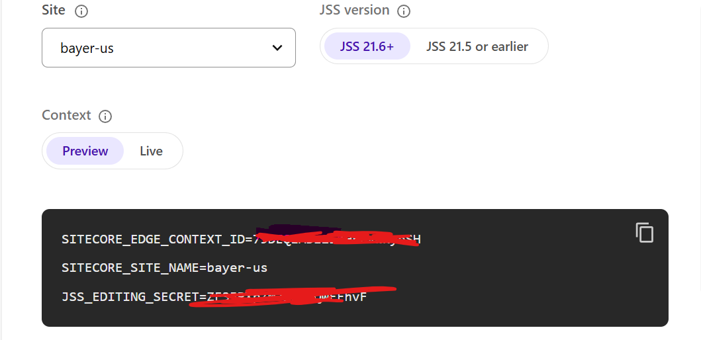

# XM Cloud Front End Application Starter Kits

This repository contains the Next.js Starter Kit, and the SPA Starters monorepo (which includes a Node Proxy Application and and SPA starter apps) for Sitecore XM Cloud Development. It is intended to get developers up and running quickly with a new front end project that is integrated with Sitecore XM Cloud.

## GitHub Template

This Github repository is a template that can be used to create your own repository. To get started, click the `Use this template` button at the top of the repository.

### Prerequisites

- Access to an Sitecore XM Cloud Environment
- [Node.js LTS](https://nodejs.org/en/) >v22 is required.

### Getting Started Guide

For developers new to XM Cloud you can follow the Getting Started Guide on the [Sitecore Documentation Site](https://doc.sitecore.com/xmc) to get up and running with XM Cloud. This will walk you through the process of creating a new XM Cloud Project, provisioning an Environment, deploying the NextJs Starter Kit, and finally creating your first Component.

### Running the Next.js Starter Kit Below is for running corp UK site, if you want to run other corp site or net site change folder paths and developer settings accordingly.

- Log into the Sitecore XM Cloud Deploy Portal, locate your Environment and select the `Developer Settings` tab.
- Ensure that the `Preview` toggle is enabled.
- Choose site from the dropdown you want to run locally, for e.g. bayer-uk
- Duplicate a new `.env.local` file from `.env` file in the `./headapps/corp` folder of this repository.
- In your .env.local file, set the following variables using the values found in the Developer Settings tab of the XM Cloud portal:
  `NEXT_PUBLIC_SITECORE_EDGE_CONTEXT_ID`
  `SITECORE_EDGE_CONTEXT_ID`
  `JSS_EDITING_SECRET`
  These should match the SITECORE_EDGE_CONTEXT_ID and JSS_EDITING_SECRET values provided in the portal.
  e.g.
  

- Run the following commands in the root of the repository to start the NextJs application:
  ```bash
  cd /ef-comms-dexp/headapps
  npm run start:corp
  or if running net site
  npm run start:net
  ```
- You should now be able to access your site on `http://localhost:3000` and see your changes in real-time as you make them, sometimes you may need to append sc_site query string manually to resolve site so effective url will have example like, http://localhost:3000/?sc_site=bayer-uk

### SPA Starters Monorepo and Angular SPA

A new starter SPA based on Angular has been introduced with JSS v22.3.0. The Angular starter has been designed to be compatible with XM Cloud and should be used with the provided node XM Cloud proxy application to handle server-side rendering (SSR), data queries, personalization and more. For more details and information on how to run and deploy the Angular starter and proxy to XM Cloud have a look at [SPA starters monorepo](headapps/spa-starters/)

## This is using the new Content SDK - Please refer to the documentation here: https://doc.sitecore.com/xmc/en/developers/content-sdk/create-a-content-sdk-app-locally.html

## Disconnected offline development

It is possible to mock a small subset of the XM Cloud Application elements to enable offline development. This can allow for a disconnected development experience, however it is recommend to work in the default connected mode.

You can find more information about how setup the offline development experience [here](./local-containers/README.md)
